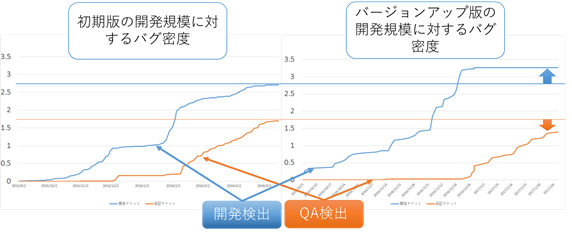

# テストの力でスクラムを良くする

伊藤 潤平(@jp_110)

## プロローグ
「うちもスクラム開発を導入します」

今までウォーターフォール開発を行っていた開発チームが、リリースのスピードを向上させる目的で、スクラムを導入することに決めました。

私は当時QA部門に所属しており、テスターとして、ウォーターフォール開発のQAフェーズでテストする業務をしていました。テストする業務とはプロダクトの品質を確保してリリースできるようにすることです。

最初は開発チームがスクラムを導入して頑張っている姿を静観していましたが、失敗の連続で、いてもたってもいられなくなりました。そこで、自らQA部門から開発チームに異動し、スクラムの中でテスト活動を支援することにしました。

本章ではQAエンジニアが、アジャイル開発をテストの力をで支え続けてきた実例を記します。

## 開発チームがスクラムを導入した結果
初めてスクラムを導入した開発チームでは、設計や実装のタスクに追われるばかりで、テストを意識的に実施出来ていなかったようでした。

開発部門からQA部門にリリースされる成果物は基本機能が動作しない時もあるほど品質が悪く、QA部門でテストが開始できるような状態ではありませんでした。その結果、プロダクトリリースの遅延リスクになってしまい、プロジェクト後半でデリバリーに関わる全ての人が疲弊してしまう問題が発生してしまいました。

品質低下の原因を調査すると、開発チームからは「とにかく時間に追われてテストする時間がない」の一点張り。開発者によってはテストコードを書いていない、テストしていても自分の実装環境のみのテストで、バックエンドとフロントエンドの結合テストが不十分な状態もありました。

その結果、QAチームが行うシステムテストでは基本機能が動作しないケースもありました。また、開発メンバーの中には「非機能はQAメンバーがテストしてくれるだろう」と高を括って開発時に性能を考慮した設計が甘い状態でプロジェクトが進み、プロジェクト後半で開発メンバーとQAメンバーが必死に対応したこともありました。

このようにスクラムを導入した結果、「テストする時間がない」という安易な理由でテストが不足していたり、「品質に関するルールがない」状態で開発が進んでしまっていたりしていました。

## 自分もスクラムチームに入るぞ！
そこで、次のプロジェクトでは、スクラムの中に、QAメンバーが入って開発メンバーと一緒にテストすると解決できるのではないかと考えました。そうすることにより、副次的にQAフェーズではスムーズな作業で完了でき、スケジュール遅延リスクを排除できるはずです。結果的にプロジェクトに関わる全ての人がハッピーになれるはずだと思いました。

具体的には、QA部門からSoftware Engineer in Test（以下、「SET」という）と言うロールでスクラムの中に入り、テストコードを実装して自動リグレッションテストを構築していく事にしました。

と言うことで自らが手を上げて、他にも3人のQAメンバーと共にスクラムチームに入りました。

## テストの力でスクラムを良くする
### 誰がどのレベルのテストを実行するかのルールを作る
スクラム開発の中では開発エンジニアのテストが曖昧だったため、先ずは、以下のようなテストレベルの定義付けと役割を作成しました。

- Unit Test・・・開発エンジニアが実行するコンポーネントテスト
- API Test・・・SETが実行する結合テスト
- E2E Test・・・QAエンジニアが実行するシステムテスト（一部SETが自動化）
- 非機能テスト・・・QAエンジニアが実行するシステムテスト（一部SETが自動化）
- 受け入れテスト・・・QAエンジニアが実行する要件確認テスト

このルールを作成することにより、開発エンジニアは最低でも自身が作成したコードのテストを行い、SETメンバーがAPIテストでバックエンドとフロントエンドの結合テストレベルをテストすることになります。また、E2Eテストや非機能テスト（主に性能テスト）も自動化できるものはSETメンバーが行います。QAにリリースされる成果物は最低でも基本機能が動作をする品質が確保できます。

### スクラムにチェックポイントを作る
スクラムの中に品質のチェックポイントを設置することにより、QAフェーズのチェックよりは完璧でないものの、ある程度の品質確保を確認できる仕組みができます。

幸いにもスクラムにはチェックポイントとなり得るルールやイベントがあるので、品質が確保できているかどうかの判断材料になります。具体的には、次の①～③のチェックポイントを設けて対応しています。

#### ①ユーザーストーリーの受け入れ条件

スクラムではPBIに「ユーザーストーリー」に「アクセプタンスクライテリア」（以下、「受け入れ条件」）を定義しています。これは品質保証プロセスで言うところの機能完全性及び利用時の品質を確保するためのチェックポイントになることがわかります。

実際に今までの受け入れ条件は、定義がタスクベースになっていました。例えば「実装を完了してビルドする」など、開発者の作業であり、ユーザーストーリーとして完結していないケースがありました。これをユーザーがソフトウェアを動作する時に満足できる状態を意識して、「～の機能が～として動作すること」などに設定し直しました。

#### ②スプリントレビュー

スクラムでは「スプリントレビュー」という公式のレビュー会が存在しており、プロダクトオーナーやステークホルダーを交えてスプリント内での成果をデモや話し合いにより確認を行います。

目的はフィードバックや周りの協力を引き出すことですが、品質保証の観点ではスプリント内での成果に対するチェックポイントとして成立します。

例えばスプリントレビューでSETメンバーが機能動作のデモと、スプリント内でテストした内容やバグ修正の内容を説明し、POからの合意を得ればある程度の品質を確保したことがわかり、結果的に問題に対する早期解決が可能になります。

### ③スプリント毎、もしくはユーザーストーリー完了時の非機能テスト

スクラムでは通常は性能に対する検証はUnDone（スプリントバックログでのやり残し）として、プロジェクト後半のリリーススプリントで実施されることが多いようです。

実際に我々のプロジェクトでもプロジェクト後半に性能検証を開始したのですが、その結果、性能問題が顕著に出てしまい、スケジュール遅延等のプロダクトリスクが発生してしまいました。

やはり性能検証は前段階で行うことが望ましく、自動化が可能なテストはSETメンバーによって自動化し、性能テストをスプリント毎、もしくはユーザーストーリーが完了した時点にチェックポイントを設けました。また自動化できないものはQAメンバーに支援してもらい、必要な時にテストをしてもらいました。こうすることで非機能問題の早期解決に繋がりました。

## どう変わった？
SETメンバーがスクラムに入り、実際にプロジェクトを実行したところ、理想的な結果となりました。

スクラム内でテストを実施し、テストのルールやチェックポイントを設定することにより、開発フェーズである程度の品質を確保できました。その結果、QAフェーズではスムーズな検証作業が実施できたため、スケジュール遅延等のプロダクトリスクを回避することができました。

以下のグラフは実際の定量的な比較データです。左のグラフがSET導入前のプロジェクト（初期版プロジェクト）で、右のグラフがSET導入後のプロジェクト（バージョンアップ版プロジェクト）です。グラフは開発規模（ソースコード規模）に対するバグ密度です。青の線が開発フェーズで検出したもので、オレンジの線がQAフェーズで検出したものですが、初期版プロジェクトに比べると開発フェーズで検出したバグ密度は約0.5%増え、QAフェーズで検出したバグは約0.5%減少しました。またこのグラフでは表せていませんが、初期版プロジェクトのQAフェーズでの検出バグは深刻度の低いバグが多かったようです。つまり、開発フェーズである程度のバグが潰せて、QAフェーズでは作業が止まるような大きな問題は出ずスムーズな検証が行われたことがわかります。

## スクラムフェス新潟
結果的にはSETメンバーによって、QAエンジニアとしての経験を活かして、テストの力でスクラムを支えることができました。

テストレベルの定義付けと役割の決定、チェックポイントの設定、そしてPOや開発チームと連携して、スクラム内で徐々に品質が積み上がる仕組みの共通認識を持てました。

おそらくこういった事例は他の多くの現場でも取り入れていると思っており、もっと話を聞きたいです。

そこで宣伝をさせてください！

スクラムフェス新潟を2022から開催します。
このフェスでは現場で泥臭いテストの話や、アジャイルで頑張ってるテスターの発表を中心に事例が聞けます。皆さんの参加を楽しみにしています。